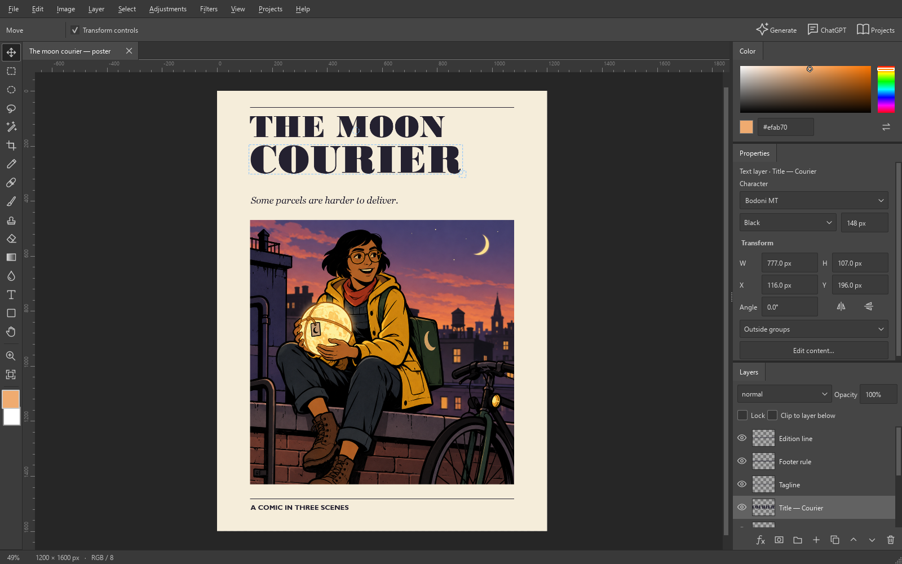

# Compositor for Windows

A layered image editor for Windows 10, with generative editing and tools an AI collaborator can use on the same canvas as you.

This edition is in active development. It preserves Robbie Tilton's original Mac application in the repository and provides a separate Windows implementation. See [current capabilities and remaining work](../module-manifest.md) before relying on a feature for production.



The tool rail keeps familiar shortcuts: V to move, M to select, B to paint and H to pan. Hover over an icon for its name and shortcut. Space-drag pans the canvas; the mouse wheel zooms. Ctrl+0 fits the artwork and Ctrl+1 shows actual pixels.

Color, Properties and Layers stay beside the canvas. Width and height in Properties are pixel dimensions; resizing a layer preserves its source pixels. Open Generate, ChatGPT or Projects from the options bar when needed, and close their panels to reclaim canvas space.

Select a text layer to change its font family, style and size directly in Properties. Double-click it to edit the wording, alignment, line spacing and color, with a preview of the rendered text. Font availability follows the fonts installed on your computer.

## Pixel art

Use **File → New pixel canvas** to draw at the image's actual pixel resolution. **Image → Convert to pixel art** previews a separate document from an existing image or selection. Choose the resolution, color count or custom palette, reduction method, detail simplification and dithering before creating it. Conversion gives you material to refine; inspect silhouettes, contours and pixel clusters afterward.

The **Pixel pencil (P)** draws square, opaque pixels. Its **Erase pixels** option removes whole pixels. Converted documents show their palette in Color and use nearest-neighbor display and layer transforms. **View → Pixel grid** reveals the grid at 800% zoom and above. PNG export offers whole-number enlargement while the document retains its original resolution.

Regional generation uses surrounding context on a working image with dimensions divisible by 64 and at least 1024 pixels on its long side. The selection determines where the result is applied. Generate offers smooth or nearest-neighbor sampling; the app retains the provider's original bytes and normalizes crop-edit candidates to the working dimensions. Applied selections remain editable layer masks.

## Glitch Temple

Choose **Filters → Glitch Temple…** to build a treatment with Tai Mei's sorting, signal, spatial, dither and character effects. Add effects, reorder them, and use **Where** to restrict each effect to brightness, edges, color or a geometric pattern. ASCII, Zhuyin, PETSCII Study, Ultimate Sort and Wizprocess expose their additional controls in the Effect tab.

Render a preview, compare it with **Original**, then apply it. **Composition** shows the treatment among the document's other layers, including masks, transforms and lettering; turn it off to inspect the treatment alone. A layer treatment keeps the original underneath and retains its source pixels and recipe inside the new layer. Reopen Glitch Temple with that layer selected to revise from the retained source. Save `.compwin` to carry the treatment with the document. Keep subsequent hand-painted details on separate layers if you want them to survive another render of the treatment.

The Color tab supports four chosen colors, colors extracted from the source, and generated color relationships. **Build palette from settings** updates the swatches. Save and load recipes to reuse a treatment; **New structure** and **New colors** produce new seeds while preserving the current source.

Pixel documents default to **Document palette** and **Hard transparency edges**. These controls finish the treatment on its original pixel grid, including every animation frame. Choose **Effect colors** to allow colors outside the document palette, or enable **Dither to palette** for a stippled transition between palette colors.

Apply the treatment before exporting a GIF or MP4 loop. Other document layers, including captions and painted finishing, remain in the composition. Set frame count and speed in Recipe. For pixel artwork, choose **Pixel enlargement** to export at 1×, 2×, 4× or another whole-number scale. **Output size** shows the resulting dimensions. Other artwork uses **Fit within** to set the maximum dimension. Exports support up to 3840 pixels per side. Changing these controls, frame count or speed does not require another still preview. GIF preserves transparency and supports up to 256 colors per frame. MP4 compresses colors, has no transparency, and pads odd dimensions to even with black. Use PNG or a palette-limited GIF when exact pixel colors matter. Stop cancels the current render or export.

The installed app includes the local renderer and animation encoder. Glitch Temple does not require Processing, Java, Node, or a separate installation. This integration uses its Canvas algorithms; the original Processing renderer and byte-native PETSCII editing are not included. See [source provenance and rebuilding](glitch-engine/README.md).

`compositor_glitch` exposes the same effect catalog, recipes, renders, application, variation and loop exports to the embedded collaborator and external MCP clients. `compositor_inspect_glitch` shows the captured composition by default; `scope` can also select the isolated layer or original composition. These operations do not activate the desktop window.

## Run from source

For the packaged app, use the [Windows preview downloads](https://github.com/almosthuman-ai/Compositor/releases/tag/v0.1.0-preview.1) and [getting-started guide](QUICK_START.md). The instructions below are for development.

Install Python 3.11 for Windows, then run:

```powershell
git clone https://github.com/almosthuman-ai/Compositor.git
cd Compositor
git switch windows-studio
powershell -ExecutionPolicy Bypass -File windows/setup.ps1
.venv/Scripts/pythonw.exe windows/run.py
```

The editor works without an account. Save `.compwin` documents to retain editable layers, masks, typography, adjustments and generation provenance. Export PNG, JPEG, WebP or TIFF for other applications. Imported originals stay intact.

## Build a standalone app

First [build and package the animation encoder](encoder/README.md). Its complete corresponding source archive ships beside the executable. Source users who need GIF or MP4 export also need this build; the installed application includes it.

```powershell
powershell -File windows/build.ps1
.venv/Scripts/python.exe windows/package_release.py
```

The build creates `dist/Compositor/Compositor.exe` and a console companion, `Compositor-Tools.exe`, for MCP. Keep both beside the `_internal` directory. Packaging downloads a checksum-verified NSIS compiler and creates a per-user installer, portable ZIP and SHA-256 checksums in `dist/releases`. Both downloads include the complete animation encoder sources. The installer creates Desktop and Start Menu shortcuts; the installed app does not require Python.

`windows/install.ps1` is available for local developer installations. Public users should use the setup download or portable ZIP.

## ChatGPT in the editor

Open the ChatGPT panel and choose **Sign in with ChatGPT**. Compositor uses OpenAI's official [Codex App Server](https://learn.chatgpt.com/docs/app-server) to manage sign-in, authentication refresh and the conversation. If Codex is absent, the app downloads the official Windows runtime and verifies its published checksum. Compositor keeps its sign-in and conversation separate from other Codex installations.

ChatGPT can inspect the canvas and use the same editing operations as the application. Its available models and native image generation depend on the signed-in account. Native image results appear as retained candidates in Generate. Subscription access is separate from API billing; signing in does not provide an Images API key.

The editor connects its tools automatically. GPT-6-Sol is the initial chat model; choose another from the model list. When signed in, the panel shows your account email when available and **Sign out**. Questions stay in the panel, so background work can continue while you type in another application. In Settings, you can choose a working folder for conversation files or keep the folder Compositor manages.

You can write your first message before setting up ChatGPT. Compositor installs the required support and keeps the message pending through sign-in. **Stop** cancels a pending message. A working-folder change reconnects an idle conversation automatically; **Reconnect ChatGPT** is also available in Settings. Replies display formatted text, and active requests show elapsed time and when the runtime last reported activity.

Runtime installation, OAuth sign-in and a signed-in GPT-6-Sol conversation have been verified on Windows 10. The live conversation inspected the project and cast, edited and restored layers with undo, and generated a subscription image using the project's character reference and style. The image remained a review candidate, preserving the existing page.

## Image providers

In Settings, choose an OpenAI-compatible or Gemini provider, enter its image model and save your API key. Keys are stored in Windows Credential Manager; `OPENAI_API_KEY` and `GEMINI_API_KEY` environment variables are also supported. A compatible OpenAI endpoint can be configured for another provider.

Generate a new image, edit the composite, or refine a selected region. Region edits send surrounding context and your chosen references; the saved selection bounds where the result is applied. Choose a built-in style or create one in the style library. Each profile can include direction before and after your prompt, plus reference images. **Review prompt** shows the assembled instructions before you generate. Candidates retain their inputs, prompt, provider and native dimensions. Applying a candidate adds a layer; if you changed its source while it was generating, the app keeps the candidate for manual placement.

**Generate with** selects the API provider or your ChatGPT subscription for images, project pages and character sheets. The subscription route sends the prepared prompt and references to the embedded conversation. It never switches to API billing automatically.

## Use with any MCP client

Start Compositor. Settings → **Copy external editor connection** copies the installed command and its configuration for an external MCP client. The embedded ChatGPT connection needs no manual configuration. A stdio configuration looks like this:

```json
{
  "mcpServers": {
    "compositor": {
      "command": "C:/path/to/Compositor/Compositor-Tools.exe",
      "args": ["--mcp"]
    }
  }
}
```

For development, use the repository's `.venv/Scripts/python.exe` as the command and pass the absolute `windows/run.py` path followed by `--mcp`.

The tools expose workspace inspection, document creation and opening, layer and pixel operations, selections, masks, undo/redo, image inspection, generation, candidate application, saving and export. `compositor_prepare_generation` captures source images for a collaborator's own image-generation tools. Edits can carry `expectedRevision` to reject stale assumptions. The local connection uses a per-user authentication token; tools do not return credentials.

## Artwork, comics and books

The Projects panel creates standalone artwork, comics and illustrated books with up to 64 pages. Every page is a layered document. Add prose and an image prompt to each page. In **Style & cast**, choose the project style, create named characters and select who appears on the current page. Attach character images or generate a reference sheet, inspect the candidate, then choose **Use reference**. Page generation includes the selected characters, project style and general references automatically.

A project keeps its own style instructions and copied reference images. Editing a reusable style in the library leaves existing projects unchanged. Character references and identity notes guide generation; inspect the results and refine any inconsistencies.

Projects save locally as you work. **Save** creates a portable `.compbook` containing all pages, editable layers, prose and references, then remembers that file for later saves. **Open** returns to the existing project when the file is unchanged. The project file menu offers **Save as…** and **Open a copy…** for independent versions. If a file has changed outside Compositor, opening it preserves the previous working version as a separate project. Page text drafts survive refreshes, page switches and restarts.

Export a self-contained HTML reading copy or a PDF with artwork and prose. PDF pages keep the artwork's proportions, with any additional writing beneath the image. Lettering composed on the canvas stays in place. **Present** opens a full-screen view with page navigation and an optional two-panel comic layout. Human navigation and MCP selection use the same page. These features work without a connected Studio service.

## Connect an existing studio

Owen & Vic Studio can be connected through its local service URL in Settings. Existing projects remain owned by that service. Bring a selected image into the editor, edit its layers, and return the composite as a new project image. Its existing enhancement and production operations remain available through the connector.

## Recovery and local data

Settings, recovery snapshots, generated candidates and chat history live in `%LOCALAPPDATA%/Compositor`. `COMPOSITOR_DATA` selects an alternate store for testing or a separate installation. Unsaved documents reopen from recovery; an explicit Save creates your chosen project file. Failed or interrupted requests remain visible in Generate and are never retried automatically.

The window's size, position and open panels return when you reopen the app. Compositor adjusts the restored window to the available screen if your display arrangement changes.

## Development

```powershell
.venv/Scripts/python.exe -m pytest windows/tests -q
.venv/Scripts/python.exe windows/verify_distribution.py dist/Compositor
```

Tests use isolated stores and simulated image providers. They do not require accounts or spend image credits. The [module map](../module-manifest.md) identifies the shared document owner, rendering, UI, generation, chat, connector and operator surfaces.

The fork retains the [MIT license](../LICENSE). Runtime dependencies keep their own licenses; see [third-party notices](THIRD_PARTY_NOTICES.md).
